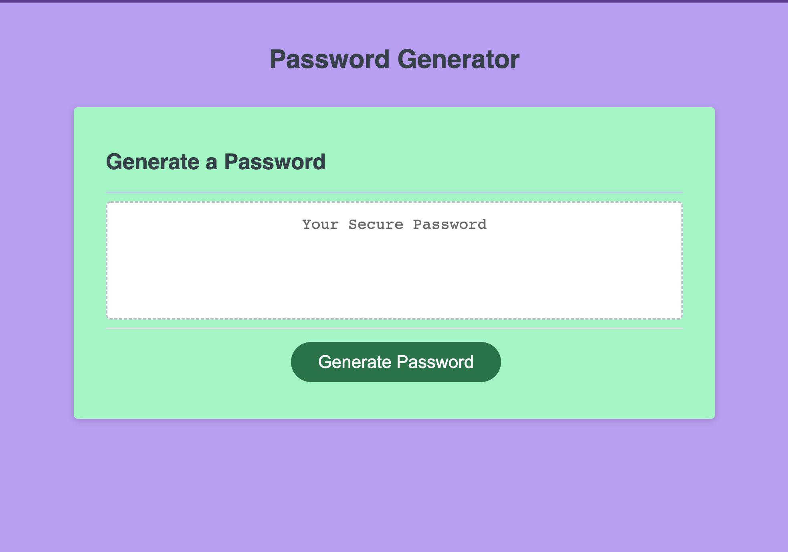
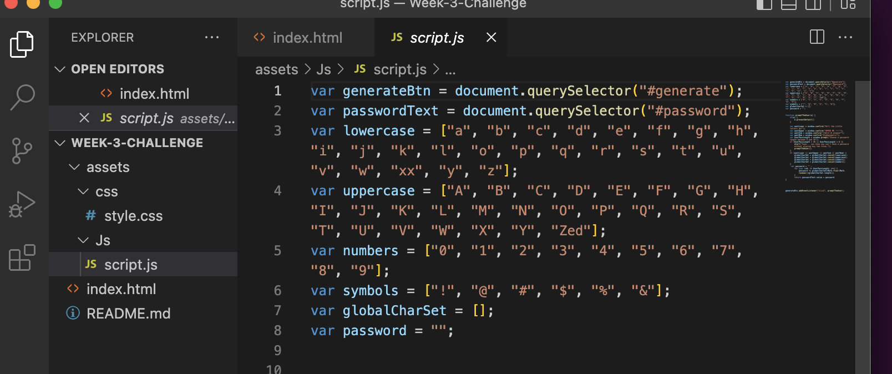

# Week 03 Challenge

## Intentions of this challenge

The purpose of this challenge is to create a password generator that will allow the user to generate a password that fits acceptance criteria. The interface comply with UI standards of accessibility and flexible screen size. 
[My deployed page.](https://katsaymeow.github.io/password-generator-assignment/)

***

### **Steps to take to complete the code:**
*** 
I started by creating my file structure in my repository folder. I then created my repository and pushed my repository. Following this step in the future will help with file structure. 

***

I then went in and began assigning the var I knew I needed. 

***

I then needed to create the function to run a random, user defined password. I also used the .preventDefault event to stop the page form auto loading after each run of the promptTheUser function. I used the concatenate method to combine the arrays for the random character set. I then assigned the password var to use the user length input to populate the password. 

***
>## Author's note:
>I have humor, so "Z" = >Zed and "x" = xx. Just for fun 😃
***

## Conclusion

I tried numerous ways to get my password to return to the textarea and was stuck after that for a while. I asked my tutor, Eric and Mike in office hours( they helped me eliminate most of my failed attempts and pointed me in the right direction ), and finally askBCS. It turned out that I had reversed the passwortText equation in the end. I spent a lot of time trying to figure out how to return the function in the textarea. I learned a lot throughout the whole experience, most importantly, to know when to ask for more help if you need it. 

## Sources 

https://www.studytonight.com/post/building-a-password-generator-with-javascript

I really liked how the author incorporated the options for length, numbers and letters as checkmarks in the box that generated the password. So I tried to add that option and it did not work out. I went back to the window prompt method, for the sake of time. I really wanted to add the checkboxes and a copy button. It would be best for user functionality. I like how this article is presented, giving step by step directions of the logic taken. It helped me with understanding the direction my inputs had to go in. 

https://www.w3schools.com/js/js_htmldom.asp 

I needed to really understand how the javascript is acting with the html.

Also, about 30 MDN pages. I went all over the place with this one. 
